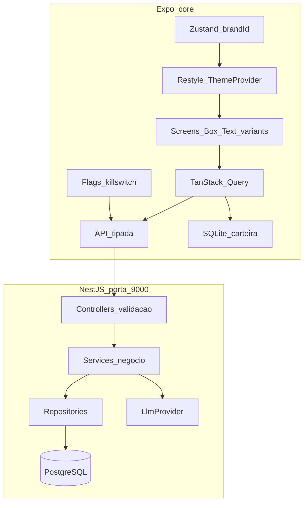

# ADR-001 — Stack e arquitetura do MVP

- **Status:** Aceita
- **Data:** 2026-09-01
- **Contexto:** Desafio Tecsa Group (Dev Mobile Pleno). Ver [`../brief.md`](../brief.md) e [`../../AGENTS.md`](../../AGENTS.md).

## Contexto

O enunciado ([`brief.md`](../brief.md)) define o produto (core white-label, duas marcas, fatia do nutricionista) e a stack permitida: Expo + TypeScript no mobile; Laravel 10+ ou Node.js no backend; MySQL ou PostgreSQL; LLM via API; Docker com API na porta 9000. Também pede REST em camadas (Controller → Service → Repository), lista virtualizada, flags com kill switch de IA, OTA, capacidade nativa e offline com update otimista.

## Decisão

Backend: **Node.js + NestJS**, opção prevista no enunciado. As camadas Controller (validação), Service (negócio e LLM) e Repository (banco) ficam explícitas nos módulos.

Mobile: **Expo + TypeScript** (obrigatório) e **Shopify Restyle** como design system de tokens — duas identidades no mesmo core, sem UI kit pronto.

## Stack fechada

| Camada | Escolha | Por quê |
| --- | --- | --- |
| Mobile | Expo (SDK atual) + TypeScript | Obrigatório |
| Design system | `@shopify/restyle` | Tokens tipados (cor, espaço, texto, raios); componentes do core, não de um UI kit. Sem Material / Carbon / NativeBase |
| Navegação | Expo Router | File-based, fácil de justificar; deep link por paciente |
| Estado servidor | TanStack Query | Cache, retry, optimistic update — casa com offline |
| Estado de UI/marca | Zustand (`brandId`) + Restyle `ThemeProvider` | Zustand só escolhe a marca; o tema Restyle é quem pinta a UI |
| Lista | `@shopify/flash-list` | Virtualização (red flag se faltar); mesmo ecossistema Shopify do Restyle |
| Offline | `expo-sqlite` + persistência da carteira | Carteira local; Query faz optimistic update |
| Nativo | `expo-local-authentication` | App é do **nutricionista**; biometria protege dados de saúde. HealthKit no aparelho do nutricionista não faz sentido de produto |
| OTA | EAS Update (`expo-updates`) | Bundle JS sem store review; justificar no README |
| Flags | Endpoint próprio `GET /v1/flags` | Kill switch de IA sem vendor; funciona offline com último valor em cache |
| Backend | NestJS + TypeScript | Controller / Injectable Service / Repository batem com o enunciado |
| ORM | Prisma **atrás** de Repositories | DX TypeScript; Prisma não vaza para Controller |
| Banco | PostgreSQL | JSONB para biomarcadores; imagem oficial no Compose |
| LLM | Interface `LlmProvider` + OpenAI como default | Service de negócio chama a interface; chave só em env |
| Infra | Docker Compose, API na **9000** | `docker compose up` sobe API + Postgres |
| Testes | Nest (Jest): unit em Services + 1 e2e; mobile: teste do brand resolver e do kill switch | Cobre o red flag de “sem testes” sem inflar o MVP |

## Arquitetura

White-label: **core não importa marca**. Cada marca é um `Theme` Restyle (`vitaTheme`, `nexoTheme`) — `colors`, `spacing`, `textVariants`, `borderRadii`, `breakpoints` — mais `logo` e `copy` fora do tema. Zustand guarda `brandId`; `ThemeProvider` do Restyle recebe o tema resolvido. Telas e primitivos (`Box`, `Text`, `Card`, `Button`) usam só variants/tokens. Sem `StyleSheet` solto com hex da marca e sem biblioteca de componentes prontos (Material, Carbon, Paper, NativeBase).

No vídeo de entrega, um switch de marca troca o tema em runtime e prova o desacoplamento sem dois binários.

## Fatia vertical de produto

Domínio mínimo, suficiente para a rubrica:

- Carteira de pacientes (lista virtualizada, busca, estados loading/empty/error/success)
- Detalhe: biomarcadores (ex. glicemia, HbA1c, vitamina D, peso) + notas
- Ações de IA: 3–5 recomendações estruturadas para o nutricionista (não chat livre)
- Kill switch `ai_actions`: se `false`, a UI esconde geração e a API retorna 403/desligado sem chamar o LLM
- Offline: lista e detalhe da carteira leem o SQLite; mute de nota ou “marcar ação aplicada” é optimistic + sync

## Mapa de pastas (alvo)

- `mobile/` — Expo app: `src/core` (api, query, db, flags, navigation, primitivos Restyle), `src/brands` (dois `createTheme` + logo/copy), `src/features/patients`
- `backend/` — NestJS: `patients`, `flags`, `ai-actions` cada um com `controller` / `service` / `repository`
- `docker-compose.yml` — `api:9000`, `postgres:5432`
- `docs/` — índice, brief, escopo e ADRs
- `AGENTS.md` — contexto operacional do agente (raiz)
- `README.md` — como subir o projeto

## Fases de implementação

Backlog detalhado (epic, stories, tasks): [`../escopo.md`](../escopo.md).

1. **Scaffold backend (US-01)** — Nest + Prisma + Postgres + `GET /health` na 9000. Feito.
2. **Scaffold mobile (US-02)** — Expo Router + Restyle com um tema placeholder. Feito.
3. **Backend em camadas (US-03)** — migrations (patients, biomarkers, flags), REST correto, seed com ~200 pacientes.
4. **Core mobile + duas marcas (US-04/05)** — dois temas Restyle, API tipada, FlashList, quatro estados de UI.
5. **Offline + optimistic (US-06)** — SQLite da carteira; mutação com rollback visual.
6. **Plataforma (US-07)** — flags + kill switch, biometria no detalhe, `expo-updates` justificado.
7. **IA (US-08)** — `AiActionsService` + kill switch na API e na UI.
8. **Testes + README (US-09)** — camadas, kill switch, defesa das decisões, relatório de IA.

## Consequências

- Backend e mobile no mesmo ecossistema TypeScript; Nest cobre as três camadas pedidas no enunciado.
- Restyle amarra white-label a tokens, não a um kit visual de terceiros.
- Biometria em vez de HealthKit: decisão de produto (app do nutricionista).
- Flags próprias evitam vendor; kill switch de IA é requisito de plataforma.

## Fora do MVP

Auth completa (JWT mínimo se o tempo permitir; senão seed “nutricionista único” documentado), HealthKit, LaunchDarkly, microserviços, chat de LLM, segunda linguagem no backend, UI kits prontos (Material, Carbon, Paper, NativeBase). Design system = Restyle + componentes nossos.
