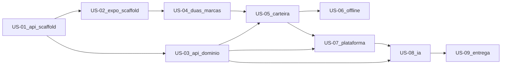

# Escopo de desenvolvimento — Tecsa Lab

Backlog do MVP. Índice: [`README.md`](README.md). Decisões: [ADR-001](adr/001-stack-e-arquitetura.md). Enunciado: [`brief.md`](brief.md). Plano de origem: scaffolds primeiro, depois contrato da API, depois a fatia mobile.

## Hierarquia

| Nível | Significado |
| --- | --- |
| **Epic** | O MVP inteiro: core white-label + fatia do nutricionista |
| **Story** | Fatia entregável, alinhada a uma fase do plano |
| **Task** | Trabalho concreto (módulo, tela, Compose) |
| **Subtask** | Passo verificável da task |

Ordem das stories é a ordem de execução. Não pular scaffold mobile para “já fazer carteira”.

## Epic

**EPIC-01 — Tecsa Lab: app white-label do nutricionista**

Como grupo Tecsa, queremos um **core único** que vista duas marcas e entregue a carteira de pacientes com biomarcadores e ações de IA, para demonstrar arquitetura mobile, plataforma (flags, OTA, nativo, offline) e API em camadas.

**Pronto quando**

- `docker compose up` sobe API na **9000** + Postgres
- App Expo troca de marca em runtime (dois temas Restyle)
- Carteira virtualizada, quatro estados de UI, offline + optimistic update
- Kill switch de IA, biometria no detalhe, OTA justificado
- Testes mínimos + README com decisões e uso de IA
- Sem red flags: marca no core, regra no Controller, JS sem TS, secret de LLM, lista sem virtualização, zero testes

**Fora do epic:** auth completa, HealthKit, LaunchDarkly, chat de LLM, UI kits prontos, segundo backend.

---

## Etapa 0 — Scaffolds

Objetivo: os dois projetos existem e a infra sobe. Sem domínio de pacientes.

### US-01 — Scaffold da API compartilhada (tecsa-lab-api)

Como avaliador, quero `docker compose up` e `GET /health` na porta 9000, para validar que o backend e o banco sobem sem regra de negócio.

**Status:** Feito  
**Fase do plano:** 1 — Scaffold backend

| ID | Task | Subtasks | Status |
| --- | --- | --- | --- |
| T-01.1 | NestJS + TypeScript em `backend/` | Pacote `tecsa-lab-api`; `main.ts` na porta 9000; CORS; `ValidationPipe` | Feito |
| T-01.2 | Prisma + Postgres | Schema só com datasource (sem patients); `PrismaModule` / `PrismaService` | Feito |
| T-01.3 | Health em camadas | Controller só delega; Service faz `SELECT 1`; 200 com `{ status, database }` | Feito |
| T-01.4 | Compose | Serviços `api` e `postgres`; API **9000**; Postgres no host **5433** (5432 já ocupada); `.env.example` sem secrets | Feito |
| T-01.5 | Docs mínimos de subida | README com `compose up` e health | Feito |

**Não entra nesta story:** pacientes, flags, LLM, Expo.

---

### US-02 — Scaffold do app Expo (core vazio + Restyle placeholder)

Como desenvolvedor, quero o app Expo no ar com TypeScript, Expo Router e **um** tema Restyle, para o core existir antes das marcas e da carteira.

**Status:** Feito  
**Fase do plano:** 2 — Scaffold mobile  
**Depende de:** US-01 (API já responde health)

| ID | Task | Subtasks | Status |
| --- | --- | --- | --- |
| T-02.1 | App Expo + TypeScript | Pasta `mobile/`; SDK atual; TypeScript estrito; `.gitignore` de Expo | Feito |
| T-02.2 | Expo Router | Layout raiz; rota placeholder (ex. “Tecsa Lab”); deep link pronto para `/patients/[id]` depois | Feito |
| T-02.3 | Restyle placeholder | Um `createTheme` (ainda não vita/nexo); `ThemeProvider`; primitivos `Box` e `Text` | Feito |
| T-02.4 | Estrutura white-label vazia | `src/core` e `src/brands` criados; `src/brands` sem segunda marca ainda | Feito |
| T-02.5 | Ponte com a API | Base URL `http://localhost:9000` (ou env); chamada tipada a `GET /health` na tela placeholder | Feito |

**Não entra nesta story:** segunda marca, FlashList, SQLite, biometria, flags, IA.

---

## Etapa 1 — Contrato e domínio na API

### US-03 — Backend em camadas (patients, flags, seed)

Como nutricionista (via API), quero listar e ver pacientes com biomarcadores, e ler flags remotas, para o app consumir um contrato real.

**Status:** Feito  
**Fase do plano:** 3  
**Depende de:** US-01

| ID | Task | Subtasks | Status |
| --- | --- | --- | --- |
| T-03.1 | Schema e migrations | Models `Patient`, `Biomarker`, `FeatureFlag`; JSONB onde couber; Prisma migrate | Feito |
| T-03.2 | Módulo patients | Controller (validação) → Service → Repository (Prisma atrás do repo); REST e status corretos | Feito |
| T-03.3 | Módulo flags | `GET /v1/flags`; flag `ai_actions` (kill switch) | Feito |
| T-03.4 | Seed | ~200 pacientes para a lista virtualizada não ser teatro | Feito |

---

## Etapa 2 — Core mobile e fatia vertical

### US-04 — Duas marcas no core (Restyle)

Como grupo Tecsa, quero trocar vita/nexo em runtime sem rebuild, para provar core desacoplado da marca.

**Status:** Pendente  
**Fase do plano:** 4  
**Depende de:** US-02

| ID | Task | Subtasks | Status |
| --- | --- | --- | --- |
| T-04.1 | Temas vita e nexo | Dois `createTheme` + logo/copy; sem hex de marca em `StyleSheet` | Pendente |
| T-04.2 | Zustand `brandId` | Store só escolhe marca; `ThemeProvider` recebe o tema resolvido | Pendente |
| T-04.3 | Switch na UI | Controle visível para o vídeo de 3–5 min | Pendente |
| T-04.4 | Primitivos | `Box`, `Text`, `Card`, `Button` só com tokens/variants | Pendente |

---

### US-05 — Carteira de pacientes no app

Como nutricionista, quero buscar e abrir a carteira com estados de UI e lista virtualizada, para operar uma base grande.

**Status:** Feito  
**Fase do plano:** 4  
**Depende de:** US-03, US-04

| ID | Task | Subtasks | Status |
| --- | --- | --- | --- |
| T-05.1 | API tipada | Interfaces de repository no domain; implementação HTTP na infra | Feito |
| T-05.2 | TanStack Query | Operations no domain (`usePatientsQuery`, `usePatientQuery`) | Feito |
| T-05.3 | FlashList | Virtualização (red flag se faltar) | Feito |
| T-05.4 | Estados de UI | Loading, vazio, erro, sucesso | Feito |
| T-05.5 | Detalhe | Biomarcadores + notas | Feito |

---

### US-06 — Offline e update otimista

Como nutricionista, quero ver a carteira sem rede e marcar nota/ação com rollback visual, para não perder o fluxo no consultório.

**Status:** Feito  
**Fase do plano:** 5  
**Depende de:** US-05

| ID | Task | Subtasks | Status |
| --- | --- | --- | --- |
| T-06.1 | SQLite da carteira | Persistência local de lista e detalhe | Feito |
| T-06.2 | Optimistic update | Mutação imediata + rollback se a API falhar | Feito |

---

## Etapa 3 — Plataforma, IA e fechamento

### US-07 — Flags, biometria e OTA

Como plataforma, quero kill switch remoto, biometria no detalhe e OTA de JS justificado, para cobrir release sem vendor extra.

**Status:** Feito  
**Fase do plano:** 6  
**Depende de:** US-03, US-05

| ID | Task | Subtasks | Status |
| --- | --- | --- | --- |
| T-07.1 | Cliente de flags | `GET /v1/flags`; cache local do último valor | Feito |
| T-07.2 | Kill switch na UI | `ai_actions=false` esconde geração | Feito |
| T-07.3 | Biometria | `expo-local-authentication` no detalhe do paciente (não HealthKit) | Feito |
| T-07.4 | EAS Update | `expo-updates` no `app.json`; justificativa no README (publicar OTA é opcional) | Feito |

---

### US-08 — Ações de IA para o nutricionista

Como nutricionista, quero 3–5 ações estruturadas a partir dos biomarcadores, e quero que o kill switch impeça a chamada ao LLM.

**Status:** Feito  
**Fase do plano:** 7  
**Depende de:** US-03, US-07

| ID | Task | Subtasks | Status |
| --- | --- | --- | --- |
| T-08.1 | `LlmProvider` | Interface + OpenAI default; chave só em env | Feito |
| T-08.2 | `AiActionsService` | Prompt com biomarcadores; JSON estruturado; sem chat | Feito |
| T-08.3 | Kill switch na API | Flag off → 403/desligado **sem** chamar o LLM | Feito |
| T-08.4 | UI das ações | Lista no detalhe; some quando a flag está off | Feito |

---

### US-09 — Testes, README e entrega

Como avaliador, quero testes que protejam camadas e kill switch, e um README que defenda as decisões e documente o uso de IA.

**Status:** Pendente  
**Fase do plano:** 8  
**Depende de:** US-08

| ID | Task | Subtasks | Status |
| --- | --- | --- | --- |
| T-09.1 | Testes Nest | Unit em Services + 1 e2e (health ou patients) | Feito |
| T-09.2 | Testes mobile | Brand resolver + kill switch | Feito |
| T-09.3 | README final | Decisões (estado, nav, OTA, flags, offline, LLM, backend) + relatório de IA | Pendente |
| T-09.4 | Vídeo | Loom 3–5 min: duas marcas, carteira, offline, kill switch, health | Pendente |

---

## Mapa rápido

**Agora:** T-09.3 (README de decisões + uso de IA) e T-09.4 (vídeo). Testes da US-09 estão feitos.
